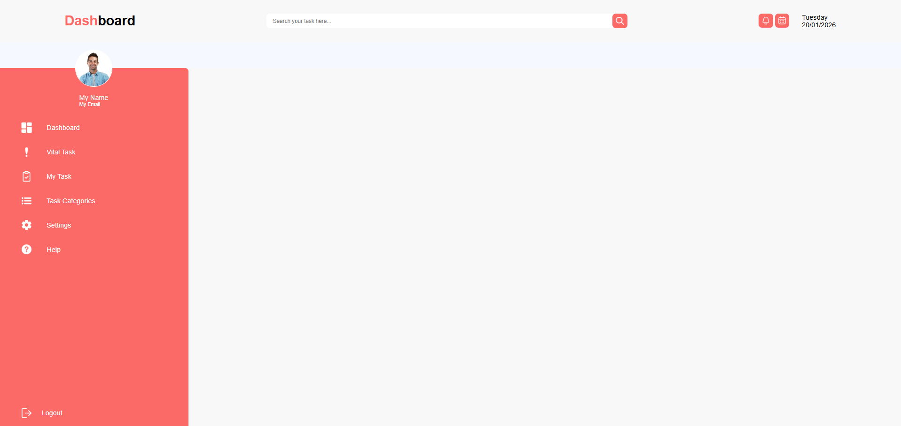

# 📝 Task Management Web App

A clean and intuitive task management application built with vanilla web technologies. This app helps users organize their daily tasks, set priorities, and track their productivity in a streamlined interface.



## 🚀 Features

* **Task Creation:** Easily add new tasks with titles and descriptions.
* **Status Tracking:** Mark tasks as "In Progress" or "Completed."
* **Persistent Storage:** Uses browser `localStorage` to keep your tasks safe even after refreshing the page.
* **Responsive Design:** Fully functional on desktops, tablets, and mobile phones.
* **Priority Levels:** Categorize tasks based on urgency.

## 📸 Screenshots

| Dashboard View | Mobile Version |
| :---: | :---: |
| ![Dashboard] | ![Mobile] |
| *Desktop interface with sidebar* | *Responsive mobile layout* |

## 🛠️ Tech Stack

* **HTML5:** Semantic structure for better accessibility.
* **CSS3:** Custom styling with Flexbox and Grid layouts.
* **JavaScript (ES6):** Dynamic DOM manipulation and data logic.

## 📦 How to Run Locally

1. **Clone the repository:**
   ```bash
   git clone [https://github.com/SohaibAlaraby/Task-Management-Web-App.git](https://github.com/SohaibAlaraby/Task-Management-Web-App.git)
